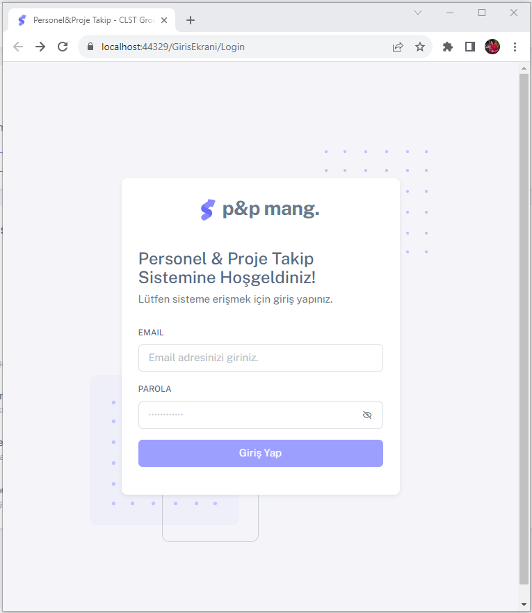
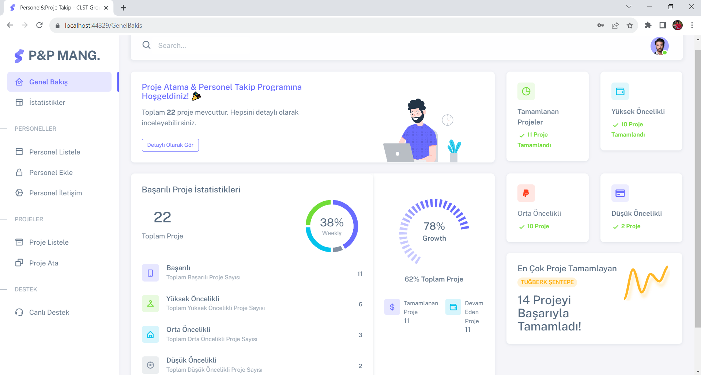

# ASP.NET MVC 5 Project: Project and Personnel Management Application [EN]

## Project Overview
This project aims to provide a comprehensive project and personnel management solution using the ASP.NET MVC 5 framework. The application offers a streamlined workflow for businesses, allowing them to efficiently manage project tracking and personnel information from a centralized platform.
The application's interface is structured around five main sections, accessible through the navigation menu on the home page: **Overview, Statistics, Personnel, Projects, and Live Support**. These sections offer users access to different aspects of the application, encompassing its full range of functionalities. Tables in the application support various operations such as copying, exporting to Excel or PDF, and printing.

## Sections:

- **Statistics**
- **Personnel**
- **Projects**
- **Project Assignment**
- **Live Support**

## 1. Statistics
The **Statistics** section offers users a range of insights to help them understand the business's performance. This segment includes data such as the number of completed projects, assigned tasks, and employee performance. These metrics empower business managers to comprehend the current state of the business and make informed decisions for future planning.

## 2. Personnel
The **Personnel** section comprises an employee directory with detailed information and job descriptions for all staff members. This section is designed to simplify human resources management. Users can edit personnel details, add new employees through the "Add Employee" feature, and modify the responsibilities of existing staff. The "Personnel Communication" feature allows users to establish communication with employees.
## 3. Projects
The **Projects** section provides an overview of all ongoing projects. The "Project List" segment displays project names, descriptions, and schedules. Users have the ability to add new projects, edit existing ones, or remove projects. Additionally, each project can be assigned one or multiple tasks.
## 4. Project Assignment
The *Project Assignment* section details the tasks associated with each project. This section includes information such as task names, descriptions, responsible individuals, and due dates. Users can edit tasks, create new ones, and update task statuses.

## 5. Live Support
The *Live Support* section offers users real-time assistance for any application-related issues they may encounter.

-------------------------------------------------------------------------------------------------

# ASP.NET MVC 5 Projesi: Proje ve Personel Yönetim Uygulaması [TR]

## Project Overview
Bu proje, ASP.NET MVC 5 çerçevesi kullanılarak oluşturulan bir proje ve personel yönetimi çözümü sunmayı amaçlamaktadır. Uygulama, işletmelerin projeleri takip etme ve personel bilgilerini merkezi bir platformdan etkin bir şekilde yönetmelerini sağlar.

Uygulamanın arayüzü, ana sayfadaki gezinme menüsü üzerinden erişilebilen beş ana bölüme dayalı olarak tasarlanmıştır: **Genel Bakış, İstatistikler, Personel, Projeler ve Canlı Destek**. Bu bölümler, kullanıcılara uygulamanın farklı yönlerine erişim sağlar ve uygulamanın tüm işlevselliğini kapsar. Uygulamadaki tablolar kopyalama, Excel veya PDF'ye aktarma ve yazdırma gibi çeşitli işlemleri desteklemektedir.

## Bölümler:

- **İstatistikler**
- **Personel**
- **Projeler**
- **Proje Atama**
- **Canlı Destek**

## 1. İstatistikler
**İstatistikler** bölümü, kullanıcılara işletmenin performansını anlamalarına yardımcı olacak çeşitli bilgiler sunar. Bu bölüm, tamamlanan projelerin sayısı, atanmış görevlerin sayısı ve çalışan performansı gibi verileri içerir. Bu veriler, iş yöneticilerinin işletmenin mevcut durumunu anlamalarını ve gelecekteki planlamalarını buna göre yapmalarını sağlar.

## 2. Personel
**Personel** bölümü, tüm personel bilgilerini ve iş tanımlarını içeren bir çalışan dizini içerir. Bu bölüm, insan kaynakları yönetimini kolaylaştırmak için tasarlanmıştır. Kullanıcılar, personel bilgilerini düzenleyebilir, "Yeni Çalışan Ekle" özelliğiyle yeni personel ekleyebilir ve mevcut personelin sorumluluklarını değiştirebilirler. Aynı zamanda "Personel İletişim" özelliğiyle personelle iletişim kurabilirler.
## 3. Projeler
**Projeler** bölümü, tüm devam eden projelerin bir özetini sunar. "Proje Listesi" bölümü, proje adları, açıklamaları ve takvimleri gibi bilgileri görüntüler. Kullanıcılar yeni projeler ekleyebilir, mevcut projeleri düzenleyebilir veya projeleri kaldırabilirler. Ayrıca her projeye bir veya birden fazla görev atanabilir.
## 4. Proje Atama
**Proje Atama** bölümü, her projeye ait görevleri detaylandırır. Bu bölüm, görev adları, açıklamaları, sorumlu kişiler ve bitiş tarihleri gibi bilgileri içerir. Kullanıcılar görevleri düzenleyebilir, yeni görevler oluşturabilir ve görev durumlarını güncelleyebilirler.

## 5. Canlı Destek
**Canlı Destek** bölümü, kullanıcılara uygulama ile ilgili karşılaştıkları sorunlar için gerçek zamanlı destek sunar.